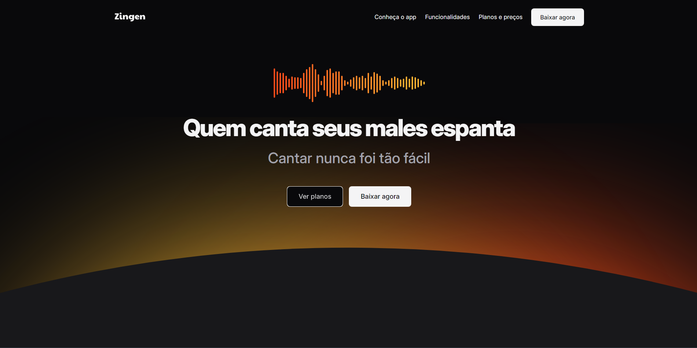
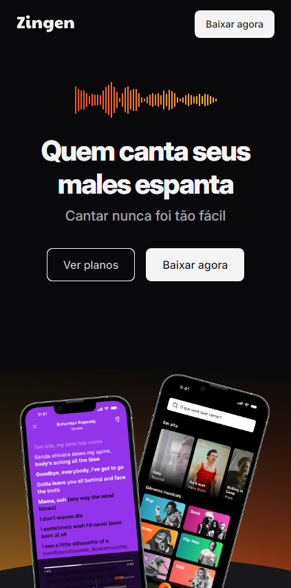
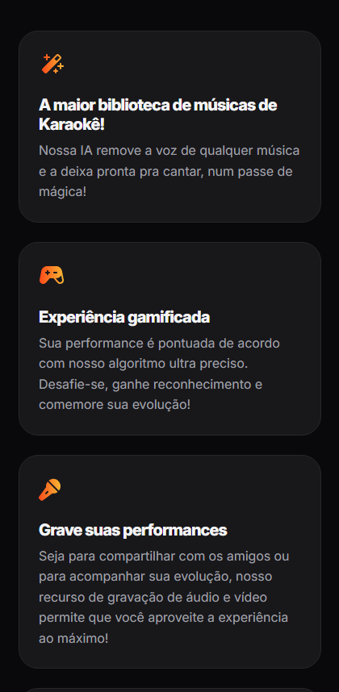
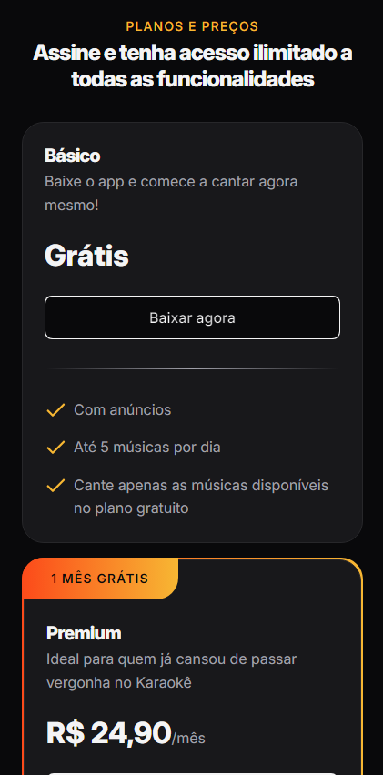

# Zingen 

**Zingen** é um site de apresentação para o aplicativo fictício de música e karaokê, projetado para proporcionar uma experiência envolvente de aprendizado e diversão ao cantar. O aplicativo utiliza inteligência artificial para aprimorar as performances vocais e permite que os usuários compartilhem suas performances com uma comunidade ativa. Este site tem como objetivo apresentar as principais funcionalidades do Zingen, permitindo aos visitantes conhecerem as vantagens do aplicativo de uma forma interativa e atraente.

O site é completamente **responsivo**, garantindo que a navegação seja agradável em qualquer dispositivo, seja em desktop, tablet ou celular. Ele foi desenvolvido para oferecer uma experiência visualmente atraente, com design fluido e adaptável, que acompanha o comportamento da tela.

## Funcionalidades

- **Design responsivo**: O layout se adapta perfeitamente a diferentes tamanhos de tela, oferecendo uma boa experiência de navegação em qualquer dispositivo.
- **Interface intuitiva**: O site tem uma navegação fácil e simples, permitindo aos usuários explorar as principais características do aplicativo de maneira clara e acessível.
- **Apresentação das funcionalidades do aplicativo**: O site detalha as capacidades do Zingen, como a remoção de voz com IA, gravação de performances e compartilhamento com a comunidade.

          

## Tecnologias Utilizadas

- **HTML5**: Estrutura e marcação do site, garantindo que a base do conteúdo seja semanticamente correta.
- **CSS3**: Estilização e design responsivo para garantir uma boa experiência em qualquer dispositivo. O uso de técnicas modernas como media queries foi empregado para adaptar o layout conforme o tamanho da tela.
- **Git**: Controle de versão durante o desenvolvimento do site, permitindo o rastreamento de mudanças e a colaboração eficiente.
- **Google Fonts**: Tipografia personalizada para um design mais atraente e legível, melhorando a estética do site.

## Sobre o Projeto

Este projeto foi desenvolvido como parte do curso **Fullstack** da **Rocketseat**, com o objetivo de criar um website para apresentação do aplicativo fictício **Zingen**. O foco do site é fornecer uma visão clara e interativa das funcionalidades do aplicativo, garantindo uma navegação intuitiva e responsiva. A proposta do projeto é fornecer uma introdução ao aplicativo de uma maneira moderna e acessível.

## Contribuições

Sinta-se à vontade para fazer um fork deste projeto e enviar pull requests. Caso tenha sugestões ou encontre algum problema, abra uma issue no repositório.

  

